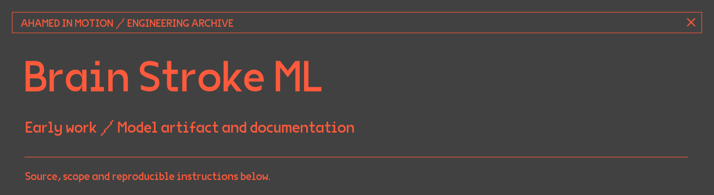

# Brain Stroke ML

An early educational project exploring brain-stroke classification from MRI images using TensorFlow/Keras and a Flask application.

This repository currently preserves the project description, dependency list and a link to the hosted model. The training notebook, application source and evaluation report described in earlier versions of this README are not included in the current tree.

## Available artifact

[Model files on Hugging Face →](https://huggingface.co/Ahamedinmotion/brainstroke-model/tree/main)

## Project context

The original work explored image preprocessing, neural-network classification, and a web interface for model inference. It was a learning project, not a clinically validated diagnostic system.

A dataset split, confusion matrix and reproducible evaluation would be needed to assess model performance. This page does not assert a current accuracy figure or patient-care benefit.

## Repository contents

- `requirements.txt` — the recorded Python dependencies.
- `LICENSE` — the repository's existing MIT licence.
- `docs/legacy-dataset-sync.yml` — the previous dataset-sync workflow, retained as an inactive historical reference. It is not an executable GitHub Actions workflow.

There are no working clone-and-run instructions here because the application source is not present. The hosted model is linked as an artifact; using it requires a compatible runtime and a documented preprocessing pipeline.

[More recent engineering work →](https://github.com/Ahamedinmotion)
